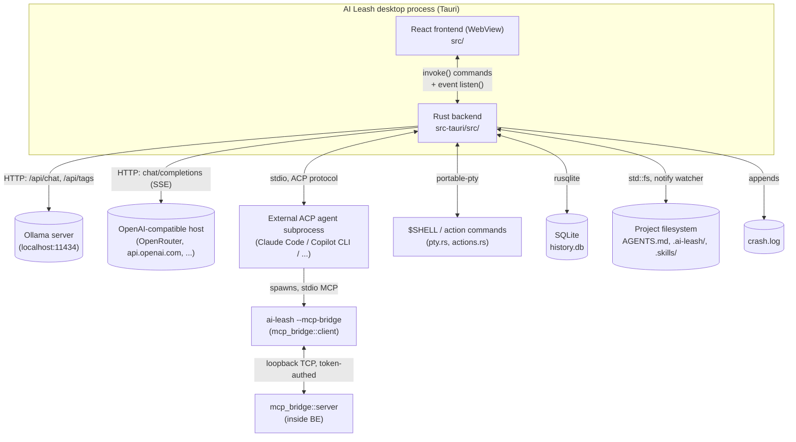
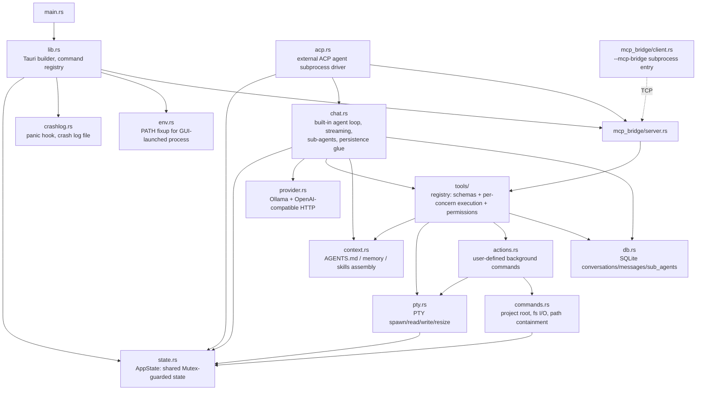
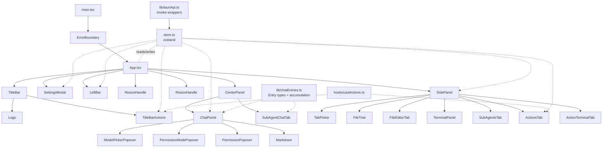

# AI Leash architecture

AI Leash is a Tauri v2 agentic harness: a React/TypeScript frontend
(WebView) plus a Rust backend, running as a single desktop process. It
talks to a local Ollama server or an OpenAI-compatible HTTP API by
default, or can instead drive an external ACP agent subprocess (Claude
Code, GitHub Copilot CLI, etc.) as an alternative agent backend. This
doc is a snapshot of the current module/component layout and how the
pieces relate — see `docs/features/*.md` for behavior-level detail per
feature (that's the source of truth if this drifts from the code).

## 1. System / process view

The ACP path is a second, independent agent backend, chosen per
conversation — when active it _replaces_ the whole Rust agent loop for
that conversation, and the external agent process does its own file
I/O directly (none of `tools.rs` runs). The MCP bridge exists only to
lend that external agent a few ai-leash-native capabilities it has no
other way to reach: spawning sub-agents, reading/writing memory, and
managing Actions.

## 2. Rust backend module graph (`src-tauri/src/`)

| Module               | Responsibility                                                                                                                                                                                                                                                                                                                                      |
| -------------------- | --------------------------------------------------------------------------------------------------------------------------------------------------------------------------------------------------------------------------------------------------------------------------------------------------------------------------------------------------- |
| `main.rs` / `lib.rs` | Entry point; installs the panic hook + PATH fixup first, before anything else can panic; builds the Tauri app, registers every `#[tauri::command]`, binds the MCP bridge listener, kills leftover Action ptys on exit.                                                                                                                              |
| `state.rs`           | `AppState` — the one shared struct: project root, live ptys, in-memory chat histories, pending permission oneshots, per-session cancellation flags/locks, touched-dirs (for AGENTS.md scoping), fs watcher handle, SQLite handle, ACP session map, MCP bridge info, permission-bypass set, Action runs.                                             |
| `commands.rs`        | Project-scoped fs commands (`set_project_root`, `list_dir`, `read_file_text`, `write_file_text`) and `resolve_within_root` — the single path-containment check reused everywhere (blocks `../` escapes) — plus the debounced filesystem watcher that emits `fs://changed`.                                                                          |
| `chat.rs`            | The built-in agent loop (`run_agent_loop`, capped at 15 tool iterations), streaming orchestration, system-prompt refresh every turn, retry/regenerate, `/clear` and `/compact`, and the always-async `spawn_sub_agent` / `resume_after_background_subtask` machinery.                                                                               |
| `provider.rs`        | `ProviderConfig` enum (`Ollama` / `OpenAiCompatible`) and `stream_turn`, dispatching to NDJSON (Ollama) or SSE (OpenAI-shaped) streaming implementations; `ProviderError::{Transient,Fatal}` drives retry logic.                                                                                                                                    |
| `tools/`             | Tool registry: `mod.rs` holds the shared types (`ToolCall`/`ToolCallFunction`), cross-cutting helpers (`truncate`, `paginate_lines`, diffing), and `execute_tool()`'s dispatch by tool name; `schema.rs` holds every tool's JSON schema (`tool_definitions()`); execution lives one file per concern — `fs_tools.rs` (`read_file`, `edit_file`, `write_file`, `list_dir`, `grep`), `shell_tools.rs` (`shell`, `run_shell_command`), `memory_tools.rs` (`update_memory`, `load_skill`), `sub_agent_tools.rs` (`spawn_sub_agent`, `list_sub_agents`, `read_sub_agent`), `action_tools.rs` (the Actions tool arms); `permissions.rs` holds the permission-request flow (`request_permission`, blocking on a oneshot channel until the UI responds, plus `respond_permission`/`set_permission_mode`). Adding a tool is a new arm in `schema.rs` + `execute_tool()` plus a function in the matching concern file, not an edit to one growing match statement. |
| `context.rs`         | Builds the system prompt from global/project/subdir `AGENTS.md`, memory files, and the skill list; `load_skill` fetch.                                                                                                                                                                                                                              |
| `db.rs`              | SQLite schema/access (`conversations`, `messages`, `sub_agents`), WAL mode, save/load/clear.                                                                                                                                                                                                                                                        |
| `acp.rs`             | Drives an external ACP agent subprocess as an alternative to `chat.rs`'s loop — process lifecycle, event mapping onto the same `chat://` events, permission bridging, model/command discovery.                                                                                                                                                      |
| `mcp_bridge/`        | `mod.rs` (shared wire types), `server.rs` (loopback TCP listener inside the main process, dispatches relayed calls into `tools::execute_tool`), `client.rs` (the `--mcp-bridge` subprocess — a stdio MCP server the ACP agent talks to).                                                                                                            |
| `pty.rs`             | Real interactive PTYs (`portable-pty`) backing both the Terminal panel and Actions.                                                                                                                                                                                                                                                                 |
| `actions.rs`         | User-defined named background commands, persisted to `.ai-leash/actions.json`, backed by `pty.rs`.                                                                                                                                                                                                                                                  |
| `crashlog.rs`        | Panic hook + durable crash log file; also accepts frontend-reported crashes.                                                                                                                                                                                                                                                                        |
| `env.rs`             | One-shot PATH fixup so GUI-launched child processes (`npx`, `copilot`, etc.) can be found.                                                                                                                                                                                                                                                          |

## 3. Frontend component tree (`src/`)

| Component                                                                        | Responsibility                                                                                                                                                                                                                                                                        |
| -------------------------------------------------------------------------------- | ------------------------------------------------------------------------------------------------------------------------------------------------------------------------------------------------------------------------------------------------------------------------------------- |
| `App.tsx`                                                                        | Top-level layout: three resizable regions (LeftBar / CenterPanel / SidePanel) under a fixed TitleBar; kicks off startup effects (provider polling, restoring last project, loading sub-agent tasks, ACP model cache).                                                                 |
| `store.ts`                                                                       | The zustand store — nearly all cross-component state: project root, open files, provider/agent-backend settings (persisted to `localStorage`), per-conversation backend choice, permission mode, panel/chat tabs (per-project), sub-agent tasks/threads, generating/permission state. |
| `TitleBar.tsx` / `TitleBarActions.tsx`                                           | Draggable native-feeling title bar (project name, settings, open-project, window controls) plus a split-button shortcut to run/stop the most-recently-used Action without opening the side panel.                                                                                     |
| `LeftBar.tsx`                                                                    | Project switcher (logo, recent projects list with busy/awaiting-approval indicators); hosts the one global `permission://` and `generating` event listeners.                                                                                                                          |
| `CenterPanel.tsx`                                                                | Tab strip: permanent `ChatPanel` (kept mounted, hidden via CSS) plus one closable tab per opened sub-agent transcript (`SubAgentChatTab`).                                                                                                                                            |
| `ChatPanel.tsx`                                                                  | The primary agent chat UI (~1700 lines): message streaming/rendering, tool-call/thinking entries, provider/ACP-agent/model picker, permission popover anchoring, slash commands, retry/compact, context-usage ring.                                                                   |
| `SidePanel.tsx`                                                                  | Multi-tab right panel: file tree, per-file editors, terminals, Sub Agents list, Actions list, per-Action terminal — all keyed/deduped/mounted per the rules in `store.ts`.                                                                                                            |
| `FileTree.tsx` / `FileEditorTab.tsx`                                             | Lazy directory tree + CodeMirror 6 editor for the active open file.                                                                                                                                                                                                                   |
| `TerminalPanel.tsx`                                                              | xterm.js terminal wired to a spawned PTY (one instance per open terminal tab).                                                                                                                                                                                                        |
| `ActionsTab.tsx` / `ActionTerminalTab.tsx` / `hooks/useActions.ts`               | Define/run/stop named background commands; a dedicated terminal tab attaches to (doesn't spawn) an Action's live pty and replays buffered output.                                                                                                                                     |
| `SubAgentsTab.tsx` / `SubAgentChatTab.tsx`                                       | Cross-project sub-agent history list; read-only transcript viewer for one sub-agent.                                                                                                                                                                                                  |
| `SettingsModal.tsx`                                                              | Provider config (Ollama host, OpenAI-compatible configs), ACP agent list, crash-log viewer, About.                                                                                                                                                                                    |
| `ModelPickerPopover.tsx` / `PermissionModePopover.tsx` / `PermissionPopover.tsx` | Chat-bar popovers: unified model/agent picker, Ask/Bypass permission mode, shell/edit/ACP approval box.                                                                                                                                                                               |
| `Markdown.tsx`                                                                   | react-markdown + remark-gfm renderer for assistant/sub-agent text.                                                                                                                                                                                                                    |
| `Button.tsx`, `ResizeHandle.tsx`, `Logo.tsx`, `ErrorBoundary.tsx`                | Small shared primitives — styled button variants, drag-resize handle, SVG wordmark, render-crash fallback.                                                                                                                                                                            |
| `lib/tauriApi.ts`                                                                | Typed `invoke()` wrappers — the entire IPC surface the frontend calls into Rust through.                                                                                                                                                                                              |
| `lib/chatEntries.ts`                                                             | Shared `Entry` union + pure accumulation helpers (`appendThinking`/`appendChunk`/`appendToolCall`/`applyToolResult`), used identically by `ChatPanel`, `store.subAgentThreads`, and `SubAgentChatTab` so all three stay in sync.                                                      |
| `lib/crashReporting.ts`                                                          | Forwards uncaught errors/rejections/React crashes to the backend crash log.                                                                                                                                                                                                           |
| `hooks/useResizableWidth.ts`                                                     | Drag-resize width hook, persists to `localStorage`.                                                                                                                                                                                                                                   |

## 4. Cross-cutting: the event/IPC surface

- **Commands** (`invoke()`, request/response): project & fs
  (`set_project_root`, `list_dir`, `read_file_text`, `write_file_text`),
  PTY (`pty_spawn/write/resize/kill`), provider (`list_provider_models`,
  `check_provider_connection`), chat (`send_prompt`, `retry_last`,
  `cancel_prompt`, `load_conversation_history`, `clear_conversation`,
  `compact_conversation`, `list_sub_agents`, `delete_sub_agent`),
  permissions (`respond_permission`, `set_permission_mode`), ACP
  (`send_prompt_acp`, `set_acp_model`, `fetch_acp_models`), Actions
  (`list/create/update/delete_action`, `run_action_cmd`,
  `stop_action_cmd`, `action_backlog`), crash log
  (`report_frontend_crash`, `get_crash_log`, `clear_crash_log`).
- **Events** (`emit`/`listen`, push):
  `chat://{sessionId}/{chunk,thinking,tool_call,tool_result,usage,generating,done,error,subtask_start,acp_model_options,acp_commands}`,
  `pty://{ptyId}/data`, `permission://{request,resolved}`, `fs://changed`.
- Both the built-in loop and the ACP backend emit the _same_ `chat://`
  event shapes, which is what lets almost the entire frontend
  (`ChatPanel`, `PermissionPopover`, persistence replay) stay
  backend-agnostic regardless of which agent is actually running.

## 5. Where to look next

- `docs/features/*.md` — per-feature behavior detail (agent loop,
  tools/permissions, AGENTS.md/memory/skills, conversation history,
  editor, terminal, crash logging, UI shell). These are the first
  place to check before changing backend/frontend behavior — treat the
  code as ground truth if it disagrees.
- `AGENTS.md` (repo root) — conventions for agents working in this repo.
